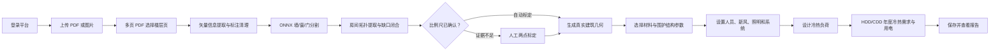

# BIM Web：建筑平面图识别与能耗计算平台

BIM Web 是一个基于 Flask 的建筑平面图 AI 识别、建筑参数配置、设计冷热负荷
和年度能耗估算平台。它把多页 PDF 图纸、ONNX 语义分割、矢量 PDF 辅助处理、
房间拓扑闭合、围护结构材料库和建筑能耗计算串成一个网页工作流。

当前代码已部署到腾讯云 Ubuntu 24.04 轻量应用服务器，并完成了公网访问、
登录、多页 PDF 选页、图纸识别、材料选择和计算链路验证。

> 本项目目前用于研发、方案比较和计算流程验证。年度模型采用 HDD/CDD
> 简化方法，不是 EnergyPlus 8760 小时逐时仿真，也不能替代法定审图、施工图
> 审查或注册工程师签署的负荷计算。

## 1. 平台能做什么

当前核心能力：

- 用户注册、登录和报告历史记录；
- 上传多页 PDF，读取页数并选择需要识别的楼层页；
- 支持 PDF、PNG、JPG、JPEG 平面图进入 AI 识别流程；
- 使用 ONNX Runtime 识别背景、墙体、窗和门；
- 对矢量 PDF 提取线段和文字，清理尺寸标注等非结构内容；
- 从图纸总尺寸自动推断比例尺，证据不足时支持人工两点标定；
- 提取房间多边形并进行保守的缺口闭合和拓扑修复；
- 根据识别结果形成墙、窗、门和房间面积等建筑几何；
- 从 SQLite 材料库选择外墙、保温、外窗、屋面、地面、外门、遮阳等参数；
- 设置建筑、人员、新风、照明、设备、供暖和制冷参数；
- 计算建筑级设计供暖热负荷和设计制冷冷负荷；
- 使用 HDD/CDD 简化模型估算年度冷热需求、设备用电和 EUI；
- 将计算输入和结果保存到用户报告数据库。

仓库中还保留 DXF、IFC、基准测试和高级仿真的接口代码，但这些不是当前
PDF 图纸生产链路的主要验收范围，使用前需要单独检查依赖和数据适配情况。

## 2. 从图纸到结果的完整流程



各阶段的主要输入和输出：

| 阶段 | 输入 | 主要输出 |
|---|---|---|
| PDF 准备 | 多页 PDF | 页数、上传令牌、选中页 |
| 图纸预处理 | PDF 矢量、文字、渲染图 | 建筑 ROI、标注掩膜、结构支撑 |
| ONNX 识别 | 清理后的平面图 | 墙、窗、门分割掩膜和轮廓 |
| 拓扑处理 | 分割掩膜、矢量支撑 | 闭合线、房间多边形、人工复核状态 |
| 比例尺 | PDF 尺寸文字或人工两点 | `scale_m_per_px`、房间真实面积 |
| 参数选择 | 建筑几何、材料库、系统设置 | 计算输入参数 |
| 设计负荷 | 围护、人员、新风、设备等 | 供暖和制冷设计负荷及分项 |
| 年度估算 | 气候度日数、运行时间、系统效率 | 年冷热需求、用电量、EUI 和评级 |
| 报告持久化 | 几何、参数、结果 | SQLite 报告记录和识别文件 |

## 3. 当前识别模型和验收基线

当前默认模型：

```text
模型名称：M2_UNet_ResNet34_DA
模型文件：M2_pub_plus_user.onnx
输入形状：[1, 3, 512, 512]
类别：background、wall、window、door
记录的 mIoU：0.787
```

腾讯云部署回归样例为文化宫 PDF 第 13 页：

```text
PDF 页：13 / 36
原始图像：[2339, 3312]
拓扑修复：dominant_span_rectangle
房间数量：19
总面积：约 1318.78 m²
人工外墙处理：不需要
```

主跨度矩形闭合使用的四条线：

```text
[704, 1405, 1976, 1405]
[704, 2502, 1976, 2502]
[704, 1405, 704, 2502]
[1976, 1405, 1976, 2502]
```

这个案例是当前版本的回归基线，不代表所有图纸都能达到相同识别效果。
扫描件、复杂标注、非正交建筑、比例尺缺失和墙线严重断裂仍可能需要人工复核。

## 4. 技术架构

| 层级 | 技术与职责 |
|---|---|
| Web | Flask、Jinja2、JavaScript、CSS |
| 身份和报告 | SQLite、Werkzeug 密码哈希、Flask Session |
| 图纸读取 | pdfplumber、pdf2image、Poppler、OpenCV |
| OCR | RapidOCR，用于矢量 PDF 缺少可提取尺寸文字时的数字识别 |
| AI 推理 | ONNX Runtime，CPU 默认可运行 |
| 几何 | OpenCV、Shapely、ezdxf |
| 负荷 | `design_load_calc.py` 建筑级设计冷热负荷 |
| 年度能耗 | `energy_calc.py` HDD/CDD 简化模型和设备能耗 |
| 数据库 | 建筑库、围护结构 SQLite 库、用户和报告 SQLite 库 |
| 生产运行 | Nginx → Gunicorn → Flask |
| 服务管理 | systemd |
| 代码发布 | 本地 `main` → 私人 GitHub `origin/main` → 腾讯云 |

生产请求路径：

```text
浏览器
  → Nginx :80（配置 HTTPS 后使用 :443）
  → Gunicorn 127.0.0.1:8000
  → Flask web_server_server:app
  → ONNX / SQLite / 上传结果目录
```

Gunicorn 只监听 `127.0.0.1:8000`，不要在腾讯云防火墙中开放 8000 端口。

## 5. 主要文件和目录

### 5.1 应用入口

| 路径 | 用途 |
|---|---|
| `web_server_server.py` | Flask 主入口、登录、上传、识别、计算、报告接口 |
| `run_local.py` | Windows 本地开发启动入口，默认 `127.0.0.1:5000` |
| `setup_venv.ps1` | 创建 `.venv` 并安装受约束依赖 |
| `start_local.ps1` | 使用项目 `.venv` 启动本地服务 |
| `.env.example` | 生产环境变量示例，不包含真实密码 |

### 5.2 图纸识别

| 路径 | 用途 |
|---|---|
| `floorplan_onnx.py` | ONNX 加载、预处理、推理、后处理和几何轮廓 |
| `vector_pdf_scale.py` | 矢量 PDF 提取、尺寸识别、比例尺和结构/非结构掩膜 |
| `floorplan_ocr.py` | 尺寸数字 OCR 后备流程 |
| `floorplan_rooms.py` | 房间闭合区域、多边形和真实面积换算 |
| `floorplan_topology_repair.py` | 外墙缺口、主跨度矩形和多缺口拓扑修复 |

### 5.3 材料、负荷和能耗

| 路径 | 用途 |
|---|---|
| `energy_library.py` | 读取建筑材料和围护结构参数库 |
| `design_load_calc.py` | 供暖、制冷建筑级设计负荷及分项 |
| `energy_calc.py` | HDD/CDD 年度热需求、设备用电、EUI 和评级 |
| `data/building_library.db` | 建筑构造和材料基础库 |
| `data/envelope_databases/` | 正式围护结构参数库 |

### 5.4 前端和测试

| 路径 | 用途 |
|---|---|
| `templates/energy.html` | 识别、参数选择、计算和报告主页面 |
| `templates/login.html` | 登录页面 |
| `templates/register.html` | 注册页面 |
| `templates/landing.html` | 公开着陆页 |
| `static/` | 公共样式和脚本 |
| `tests/` | 识别、拓扑、比例尺、材料库、计算、模板和部署测试 |
| `tools/` | 模型导出、数据收集、报告结构化和材料库导入工具 |

### 5.5 生产部署

| 路径 | 用途 |
|---|---|
| `deploy/bim-web.service` | systemd 服务模板 |
| `deploy/nginx-bim-web.conf` | Nginx 反向代理模板 |
| `deploy/README.md` | Ubuntu 24.04 首次部署指南 |
| `requirements.txt` | Python 依赖 |
| `requirements-runtime-constraints.txt` | NumPy、OpenCV、ONNX Runtime 等已验证版本 |

## 6. 文件应该保存在哪里

| 内容 | GitHub | 本地开发机 | 腾讯云服务器 |
|---|---:|---|---|
| 程序代码、模板、测试 | 是 | 项目目录 | `/opt/bim-web/app` |
| 正式材料 SQLite 库 | 是 | `data/` | `/opt/bim-web/app/data` |
| ONNX 模型 | 否 | `models/` | `/opt/bim-web/models/` |
| 用户账号与报告库 | 否 | `users.db` 或 `DB_PATH` | `/var/lib/bim-web/users.db` |
| 上传 PDF 与识别结果 | 否 | `uploads/` | `/var/lib/bim-web/uploads/` |
| 本地虚拟环境 | 否 | `.venv/` | `/opt/bim-web/venv/` |
| 环境变量和密码 | 否 | 当前终端环境或本地 `.env` | `/etc/bim-web/bim-web.env` |
| SSH 私钥、Deploy Key | 否 | 私人安全目录 | 服务器用户 SSH 目录 |
| 原始检测报告和研究数据 | 否 | 外部数据盘 | 不随网站部署 |

服务器目录关系：

```text
/opt/bim-web/app/                 GitHub 代码
/opt/bim-web/venv/                Python 虚拟环境
/opt/bim-web/models/              独立 ONNX 模型
/var/lib/bim-web/uploads/         PDF、图片和识别结果
/var/lib/bim-web/users.db         用户、报告和计算结果
/etc/bim-web/bim-web.env          生产环境变量
```

`users.db`、`uploads/`、模型和环境文件都在代码发布范围之外，正常
`git pull` 不会覆盖这些内容。

## 7. 环境变量

`.env.example` 中的生产变量：

| 变量 | 用途 |
|---|---|
| `SECRET_KEY` | Flask Session 签名密钥，生产环境必须使用长随机值 |
| `ADMIN_USER` | 后备管理员用户名 |
| `ADMIN_PASSWORD` | 后备管理员密码；未设置时后备管理员登录不启用 |
| `ONNX_MODEL_PATH` | 当前使用的 ONNX 模型绝对路径 |
| `UPLOAD_FOLDER` | 上传文件和识别结果根目录 |
| `DB_PATH` | 用户和报告 SQLite 数据库 |
| `BUILDING_LIBRARY_DB_PATH` | 建筑材料基础库 |
| `ENVELOPE_DB_DIR` | 围护结构数据库目录 |

不要把真实值写入 `.env.example`、README、代码或 Git 提交。

## 8. Windows 本地开发

### 8.1 前置条件

- Windows 10/11；
- Python 3.12；
- PowerShell；
- Git；
- Poppler。程序会优先读取 `POPPLER_PATH`，也会检查项目工具目录和 Codex
  本地运行时缓存。

### 8.2 创建项目环境

在项目根目录执行：

```powershell
.\setup_venv.ps1
```

脚本会创建 `.venv`，安装 `requirements.txt`，应用
`requirements-runtime-constraints.txt`，最后运行 `pip check`。

如果需要指定基础 Python：

```powershell
$env:BIM_WEB_BASE_PYTHON="C:\Path\To\Python312\python.exe"
.\setup_venv.ps1
```

### 8.3 配置本地变量

```powershell
$env:ADMIN_USER="admin"
$env:ADMIN_PASSWORD="仅用于本地的强密码"
$env:SECRET_KEY="本地随机字符串"
$env:ONNX_MODEL_PATH=(Resolve-Path ".\models\M2_pub_plus_user.onnx").Path
```

也可以通过注册页面创建本地数据库账号。

### 8.4 启动

```powershell
.\start_local.ps1
```

浏览器访问：

```text
http://127.0.0.1:5000
```

也可以直接运行：

```powershell
.\.venv\Scripts\python.exe run_local.py
```

### 8.5 标准测试

本项目使用 Python `unittest`，当前标准命令不是 `pytest`：

```powershell
.\.venv\Scripts\python.exe -m unittest discover -s tests
```

开发识别算法时至少运行对应测试：

```powershell
.\.venv\Scripts\python.exe -m unittest tests.test_export_floorplan_onnx
.\.venv\Scripts\python.exe -m unittest tests.test_compare_floorplan_preprocessing
.\.venv\Scripts\python.exe -m unittest tests.test_floorplan_rooms
.\.venv\Scripts\python.exe -m unittest tests.test_floorplan_topology_repair
.\.venv\Scripts\python.exe -m unittest tests.test_vector_pdf_scale
```

开发计算和材料库时：

```powershell
.\.venv\Scripts\python.exe -m unittest tests.test_envelope_libraries
.\.venv\Scripts\python.exe -m unittest tests.test_design_load_calc
.\.venv\Scripts\python.exe -m unittest tests.test_energy_calc
.\.venv\Scripts\python.exe -m unittest tests.test_energy_template
```

发布前始终运行完整测试。

## 9. 网页使用顺序

1. 登录或注册账号；
2. 打开能耗分析页面；
3. 输入报告编号；
4. 上传 PDF 或图像；
5. 多页 PDF 选择需要识别的页码；
6. 开始 AI 识别；
7. 检查墙、窗、门叠加图和房间边界；
8. 检查拓扑是否要求人工外墙处理；
9. 检查自动比例尺；如果未确认，使用人工两点标定；
10. 确认房间数和面积合理；
11. 设置层高、层数、朝向和建筑类型；
12. 从材料库选择围护结构参数；
13. 设置人员、新风、渗透风、照明、设备、供暖和制冷系统；
14. 选择计算供暖、制冷或两者；
15. 执行计算并检查设计负荷、年度热需求、用电和模型边界；
16. 在历史报告中查看保存结果。

如果没有闭合房间、比例尺没有确认，或者拓扑修复要求人工复核，平台不会直接
使用不可靠面积进入负荷计算；需要修正边界或提供人工面积。

## 10. 材料库

网页围护结构接口：

```text
/energy/library/walls
/energy/library/materials
/energy/library/envelope/<category>
```

支持的围护结构类别：

```text
exterior_wall
window_u
window_shgc
roof_u
floor_u
curtain_shading
door_u
floor_contact_type
window_air_tightness
```

材料数据应保留名称、数值、单位和来源证据。修改正式 SQLite 库前应备份，
导入后需要同时验证数据库测试、网页下拉框和计算请求。

原始检测报告、批量分类和材料结构化流程见：

[材料库数据整理与来源处理](docs/材料库数据整理与来源处理.md)

## 11. 计算范围和边界

### 11.1 设计冷热负荷

`design_load_calc.py` 输出建筑级设计负荷，主要考虑：

- 墙、窗、屋面、地面和外门传热；
- 室内外设计温差；
- 窗太阳得热；
- 人员显热和潜热；
- 照明和设备得热；
- 新风显热和潜热；
- 渗透风；
- 供暖附加系数和稳定内部得热扣除。

目前 `room_loads` 以整个建筑为一个汇总房间输出，还不是逐个识别房间的独立
负荷分配。

### 11.2 年度能耗

`energy_calc.py` 采用 HDD/CDD 简化年度模型，输出：

- 年供暖和制冷热需求；
- 供暖、制冷、风机、照明、设备和生活热水用电；
- 非电供暖购入能源；
- EUI、能效评级和等效峰值校核；
- 使用的几何、围护参数、气候和系统；
- 模型边界说明。

主要限制：

- 未进行 8760 小时逐时模拟；
- 新风年度制冷只包含显热，不包含除湿潜热；
- 人员、照明和设备得热未与冷热需求逐时耦合；
- 等效峰值用于数量级校核，不是严格设计负荷；
- 年度供暖热需求未扣除太阳得热；
- 非默认城市的室外设计温度可能来自用户输入。

## 12. Git 分支和开发规范

正式发布链路：

```text
本地 main → GitHub origin/main → 腾讯云 /opt/bim-web/app
```

旧开发历史保存在：

```text
backup/pre-github-history-20260727
```

日常修改前：

```powershell
git status --short --branch
git pull --ff-only origin main
```

发布前：

```powershell
git status --short
git diff
.\.venv\Scripts\python.exe -m unittest discover -s tests
```

只暂存已经审核的文件：

```powershell
git add -- path\to\file1 path\to\file2
git diff --cached
git commit -m "说明本次修改"
git push origin main
```

不要在混合工作区中直接使用 `git add .`。项目目录可能同时存在模型、实验
脚本、历史部署文件和本地笔记，发布前必须逐项确认范围。

## 13. 服务器更新网站

本地修改测试并推送 GitHub 后，在服务器以 root 登录，但让仓库 Git 命令
始终由 `bimweb` 执行：

```bash
runuser -u bimweb -- \
  git -C /opt/bim-web/app fetch origin main

runuser -u bimweb -- \
  git -C /opt/bim-web/app status --short --branch

runuser -u bimweb -- \
  git -C /opt/bim-web/app pull --ff-only origin main

runuser -u bimweb -- \
  /opt/bim-web/venv/bin/pip install \
  -r /opt/bim-web/app/requirements.txt \
  -c /opt/bim-web/app/requirements-runtime-constraints.txt

systemctl restart bim-web
systemctl status bim-web --no-pager
```

验证：

```bash
curl -I http://127.0.0.1:8000/login
curl http://127.0.0.1:8000/energy/ai_status
journalctl -u bim-web -n 50 --no-pager
```

最后用浏览器验证登录、PDF 选页、识别、材料选择和计算。

不要按 Git 的提示给 root 添加全局 `safe.directory`。仓库属于 `bimweb`，
以后都使用：

```bash
runuser -u bimweb -- git -C /opt/bim-web/app <Git 子命令>
```

### 13.1 什么时候需要额外操作

| 修改内容 | 额外操作 |
|---|---|
| Python、HTML、CSS、JavaScript | `git pull` 后重启 `bim-web` |
| `requirements.txt` | 重装依赖后重启 |
| `deploy/bim-web.service` | 复制到 `/etc/systemd/system/`，`daemon-reload` 后重启 |
| `deploy/nginx-bim-web.conf` | 复制站点配置，`nginx -t` 后 reload |
| 正式材料 SQLite 库 | 更新前备份数据库，拉取后重启 |
| ONNX 模型 | 不走 GitHub，按下一节单独上传和切换 |

## 14. 更新 ONNX 模型

模型文件不进入 GitHub。推荐每次使用带日期或版本号的新文件，不直接覆盖旧
模型，例如：

```text
M2_pub_plus_user_20260801.onnx
```

### 14.1 本地校验

```powershell
Get-FileHash -Algorithm SHA256 `
  .\models\M2_pub_plus_user_20260801.onnx
```

保存输出的 SHA-256，用于和服务器文件比较。

### 14.2 上传到临时目录

在本地执行，替换占位符：

```bash
scp models/M2_pub_plus_user_20260801.onnx \
  SSH_USER@SERVER_IP:/tmp/
```

也可以使用腾讯云文件上传功能。无论文件最初位于 `/tmp` 还是 `/root`，
最终都要由 root 移到模型目录。

### 14.3 移动并设置权限

```bash
mv /tmp/M2_pub_plus_user_20260801.onnx \
  /opt/bim-web/models/

chown bimweb:bimweb \
  /opt/bim-web/models/M2_pub_plus_user_20260801.onnx

chmod 0640 \
  /opt/bim-web/models/M2_pub_plus_user_20260801.onnx
```

如果上传到了 `/root`，只替换第一条命令的源路径，不要改变目标目录。

### 14.4 服务器校验

```bash
sha256sum \
  /opt/bim-web/models/M2_pub_plus_user_20260801.onnx
```

输出必须与本地一致。然后用 `bimweb` 身份加载模型：

```bash
runuser -u bimweb -- \
  /opt/bim-web/venv/bin/python -c \
  "import onnxruntime as ort; p='/opt/bim-web/models/M2_pub_plus_user_20260801.onnx'; s=ort.InferenceSession(p); print('ONNX model OK', s.get_inputs()[0].shape)"
```

### 14.5 切换模型

编辑：

```bash
nano /etc/bim-web/bim-web.env
```

将路径改为：

```dotenv
ONNX_MODEL_PATH=/opt/bim-web/models/M2_pub_plus_user_20260801.onnx
```

在 nano 中使用 `Ctrl+O`、回车保存，`Ctrl+X` 退出。然后：

```bash
systemctl restart bim-web
systemctl status bim-web --no-pager
curl http://127.0.0.1:8000/energy/ai_status
journalctl -u bim-web -n 50 --no-pager
```

再运行文化宫第 13 页或其他固定样例做回归。

### 14.6 模型回退

如果新模型加载失败或识别结果退化：

1. 将 `/etc/bim-web/bim-web.env` 中的 `ONNX_MODEL_PATH` 改回旧文件；
2. 执行 `systemctl restart bim-web`；
3. 检查 `/energy/ai_status`；
4. 重跑固定识别样例。

如果新模型改变了输入尺寸、类别顺序、类别数量、归一化或预处理方式，不能只
替换文件；必须同步修改 `floorplan_onnx.py` 和相关测试，再通过 GitHub 发布。

## 15. 生产服务说明

### systemd

服务名：

```text
bim-web.service
```

常用命令：

```bash
systemctl status bim-web --no-pager
systemctl restart bim-web
journalctl -u bim-web -n 100 --no-pager
journalctl -u bim-web -f
```

### Gunicorn

systemd 以 `bimweb` 用户启动 Gunicorn：

```text
1 worker
2 threads
gthread worker class
300 秒超时
127.0.0.1:8000
```

服务器只有 2 核、约 3.6 GiB 内存，当前配置避免多个 worker 重复加载 ONNX
模型造成过高内存占用。

### Nginx

Nginx 负责公网入口、上传大小限制和反向代理。当前模板：

```text
client_max_body_size 200m
proxy_read_timeout 300s
```

修改 Nginx 配置后：

```bash
nginx -t
systemctl reload nginx
```

当前可通过公网 IP 的 HTTP 访问。面向长期用户开放时，建议购买或绑定域名并
配置 HTTPS。

## 16. 备份

至少备份：

```text
/var/lib/bim-web/users.db
/var/lib/bim-web/uploads/
/etc/bim-web/bim-web.env
/opt/bim-web/models/
```

正式材料库随 Git 保存，但大幅更新前仍建议额外备份：

```text
/opt/bim-web/app/data/building_library.db
/opt/bim-web/app/data/envelope_databases/
```

需要一致性备份时，可短暂停止服务：

```bash
systemctl stop bim-web
install -d -m 0700 /var/backups/bim-web
cp -a /var/lib/bim-web /var/backups/bim-web/runtime-$(date +%Y%m%d-%H%M%S)
cp -a /etc/bim-web/bim-web.env /var/backups/bim-web/
systemctl start bim-web
systemctl status bim-web --no-pager
```

备份目录包含账号数据和生产密钥，只允许 root 读取。还应将备份复制到服务器
之外；同一块云硬盘上的备份不能应对磁盘损坏或实例误删。

## 17. 代码回退

先查看版本：

```bash
runuser -u bimweb -- \
  git -C /opt/bim-web/app log --oneline -10
```

临时切换到确认过的提交：

```bash
runuser -u bimweb -- \
  git -C /opt/bim-web/app switch --detach COMMIT_HASH

systemctl restart bim-web
systemctl status bim-web --no-pager
```

恢复正式分支：

```bash
runuser -u bimweb -- \
  git -C /opt/bim-web/app switch main

runuser -u bimweb -- \
  git -C /opt/bim-web/app pull --ff-only origin main

systemctl restart bim-web
```

代码回退不会自动回退模型、用户库、上传结果或环境变量；这些内容需要分别
管理版本和备份。

## 18. 常见问题

### Git 提示 dubious ownership

原因是 root 正在读取属于 `bimweb` 的仓库。不要给 root 添加
`safe.directory`，使用：

```bash
runuser -u bimweb -- \
  git -C /opt/bim-web/app status --short --branch
```

### `cv2` 提示找不到 `libGL.so.1`

Ubuntu 24.04 安装：

```bash
apt update
apt install -y libgl1
```

然后重新执行 Python 依赖导入测试。

### AI 状态 `available: false`

依次检查：

```bash
grep '^ONNX_MODEL_PATH=' /etc/bim-web/bim-web.env
ls -l /opt/bim-web/models/
runuser -u bimweb -- /opt/bim-web/venv/bin/python -c "import cv2, onnxruntime; print('dependencies OK')"
journalctl -u bim-web -n 100 --no-pager
```

### 旧账号无法登录

用户账号保存在 `users.db`，不会进入 GitHub。全新服务器如果没有迁移旧
`users.db`，旧账号不会存在。可以使用环境变量中的后备管理员登录，或重新
注册账号。

### PDF 能识别但不能计算

检查：

- 是否选择了正确页面；
- `room_topology.room_count` 是否大于 0；
- `manual_exterior_wall_required` 是否为 `false`；
- 比例尺是否为 `confirmed`；
- 房间面积是否合理；
- 是否需要人工两点标定或人工面积。

### 更新后网页没有变化

检查服务器提交和服务状态：

```bash
runuser -u bimweb -- git -C /opt/bim-web/app log -1 --oneline
systemctl restart bim-web
journalctl -u bim-web -n 50 --no-pager
```

HTML、CSS、JavaScript 修改也需要确认服务器已经拉取新提交；必要时在浏览器
执行强制刷新。

## 19. 安全注意事项

- GitHub 仓库保持 Private；
- 服务器 Deploy Key 建议保持只读；
- 不提交 `.env`、账号数据库、上传文件、模型或凭证；
- 不在聊天记录、README 或 Issue 中粘贴真实私钥和密码；
- `ADMIN_PASSWORD` 必须使用强密码；
- `SECRET_KEY` 必须使用随机值，不能使用本地默认值；
- 当前注册页面是公开入口，正式扩大用户范围前应增加注册控制和账号管理；
- 定期清理过期上传文件，但执行删除前必须先做备份并核对目标目录；
- 配置域名和 HTTPS 后再面向长期外部用户使用；
- 生产数据变更前先备份，代码发布和数据迁移分开执行。

## 20. 路线图

### 近期

- 增加经过验证的一键服务器更新脚本；
- 建立自动备份、保留周期和恢复演练；
- 配置域名和 HTTPS；
- 增加发布前文件范围与敏感内容检查；
- 完善注册控制和管理员账号管理。

### 中期

- 增加房间边界、墙线和门窗的网页人工编辑；
- 建立更多不同类型图纸的固定回归样例；
- 显示每条自动闭合线的证据和人工确认状态；
- 持续补充并审计材料库真实来源；
- 将建筑级负荷进一步分配到识别房间。

### 长期

- 多楼层、多区域和房间用途模型；
- 更完整的气候数据和逐时仿真接口；
- 模型文件版本清单、自动校验和受控发布；
- 计算公式、输入来源和结果版本的完整审计链；
- 更完善的权限、任务队列、监控和数据生命周期管理。

## 21. 相关文档

- [Ubuntu 24.04 首次部署指南](deploy/README.md)
- [GitHub 首次上传清单](docs/GitHub首次上传清单_2026-07-27.md)
- [材料库数据整理与来源处理](docs/材料库数据整理与来源处理.md)
- [PDF 图纸识别与房间闭合交接](docs/新对话交接_PDF图纸识别与房间闭合_2026-07-21.md)
- [文化宫年度能耗与运行环境交接](docs/新对话交接_文化宫年度能耗与运行环境_2026-07-15.md)
- [文化宫负荷与模型接入交接](docs/新对话交接_文化宫负荷与模型接入_2026-07-14.md)
- [当前负荷与年度能耗计算审计报告](docs/文化宫四层_当前负荷与年度能耗计算审计报告_2026-07-15.md)

## 22. 当前生产基线

```text
操作系统：Ubuntu 24.04 LTS
Python：3.12
Nginx：1.24
Poppler：24.02
模型：M2_pub_plus_user.onnx
模型 SHA-256：
ce855d661c12e7893aa6dbf7a184be641b6dfbba41b1c090fa7a8fd6a34d9d71
代码发布分支：main
服务器代码目录：/opt/bim-web/app
```

模型 SHA-256 只用于确认当前已验证基线，不代表以后模型必须保持不变。模型
更新后应记录新文件名、新校验值、回归结果和回退路径。
